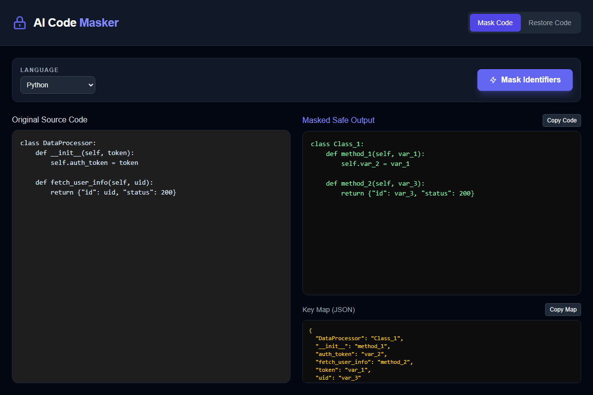

# AI Code Masker



A privacy-first developer tool that allows engineers to safely use AI tools for debugging, optimization, and feature generation without exposing sensitive identifiers.

The system masks identifiers (like variable names, class names, method names) before sharing code with an AI, and mathematically restores them after AI processing by keeping a local, decoupled mapping cache.

## Supported Languages

- Python
- Java
- JavaScript / React / TypeScript

## Features

- **Local-only execution:** No internet access required for masking.
- **Dynamic Web UI:** Built-in web application to simply paste and copy.
- **Irreversible protection:** The actual code identifiers are turned into generic placeholders (`method_1`, `var_2`). The AI model physically cannot see your business logic terminology.
- **Zero-Copy Optimised:** The masking engine leverages direct regex offset scanning and precompiled constants, keeping the memory footprint incredibly low for mono-repo parsing.

## Installation

1. Requires Python 3.8+
2. Install the Flask dependency:
   ```bash
   pip install flask
   ```

## Usage

### Using the Graphical Interface (Recommended)

1. Start the Flask server:
   ```bash
   python app.py
   ```
2. Navigate your browser to [http://127.0.0.1:3000](http://127.0.0.1:3000)
3. **To Mask:** Paste your sensitive code into the "Original Source Code" panel. Select your language, and click "Mask Identifiers". Copy the resulting safe code and the JSON Map.
4. **To Restore:** Switch to the "Restore Code" tab. Provide the AI's response in the "Masked Source Code" panel, paste your JSON map, and hit "Restore Code".

### Using the CLI

You can bypass the GUI and process entire files via the command line.
The engine scripts are located in `.agents/skills/ai-code-masker/scripts/masker.py`.

**To Mask a file:**
```bash
python .agents/skills/ai-code-masker/scripts/masker.py mask path/to/your/file.py
```
*Outputs: `file.py.masked` (the safe code) and `file.py.map.json` (the recovery map)*

**To Restore a file:**
```bash
python .agents/skills/ai-code-masker/scripts/masker.py unmask path/to/your/file.py.masked
```
*Outputs: `file.py.unmasked` (the fully restored file)*